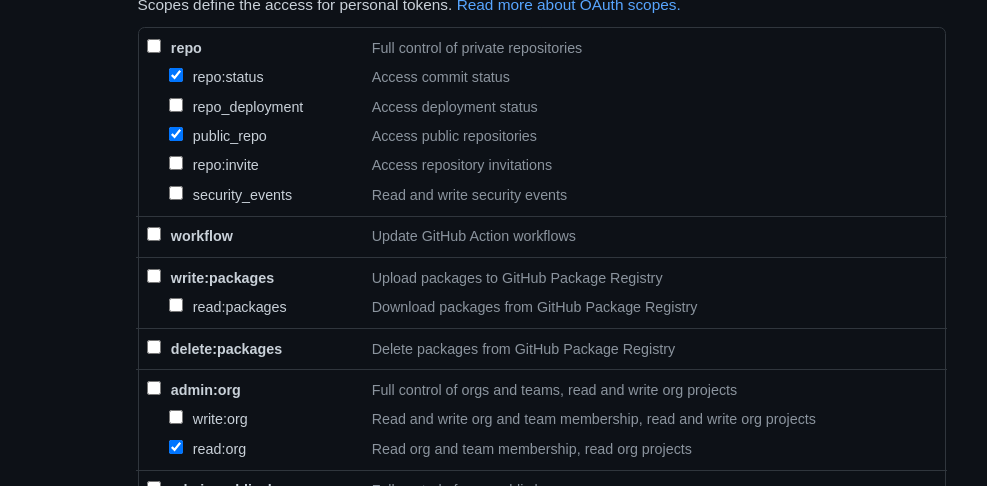

# Trybe Project Status

## Sobre

App de consulta do status dos projetos submetidos pela pessoa estudante durante o curso da Trybe. Tem como objetivo facilitar o acesso aos resultados dos projetos para identificar de forma ágil, quais estudantes estão com pendências nos projetos, com a finalidade de oferecer ajuda.

Mesmo esses dados sendo acessíveis a qualquer estudante da Trybe, não é recomendado que essa informação seja publicada em canais de comunicação, evitando qualquer desentendimento.

## Algumas Informações Técnicas

Projeto desenvolvido em React.
É apenas FrontEnd, nenhum dado é salvo localmente.
Utiliza a API do GitHub.
Necessita autênticação de um usuário com permissões a Organização Trybe (pessoa estudante ativa)

## Iniciando o Projeto

1. `git clone` (download do projeto e acessar a pasta)
2. `npm install` (instalar as dependências)
3. `touch .env` (criar o arquivo de ambiente para armazenar o token de autenticaçâo do GitHub)
4. Adicionar a linha no arquivo .env: `REACT_APP_PERSONAL_GITHUB_TOKEN=SeuToken`
5. Substituir a palavra `SeuToken` pelo token de autêncação do GitHub
6. `npm start`

#### Gerando o Token de Autenticação do GitHub

1. [Como criar um token de acesso pessoal](https://docs.github.com/pt/github/authenticating-to-github/creating-a-personal-access-token#:~:text=Na%20barra%20lateral%20esquerda%2C%20clique%20em%20tokens%20de%20acesso%20pessoal,quais%20deseja%20conceder%20esse%20token.)
2. Será necessário as permissões abaixo:
   
